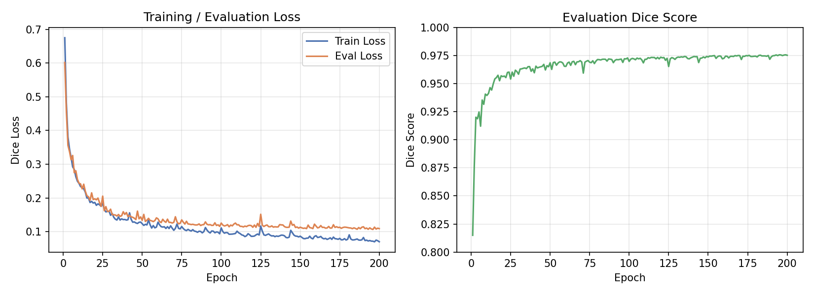
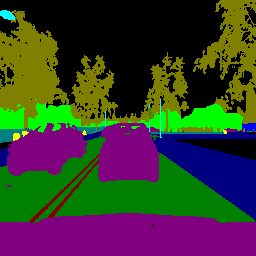
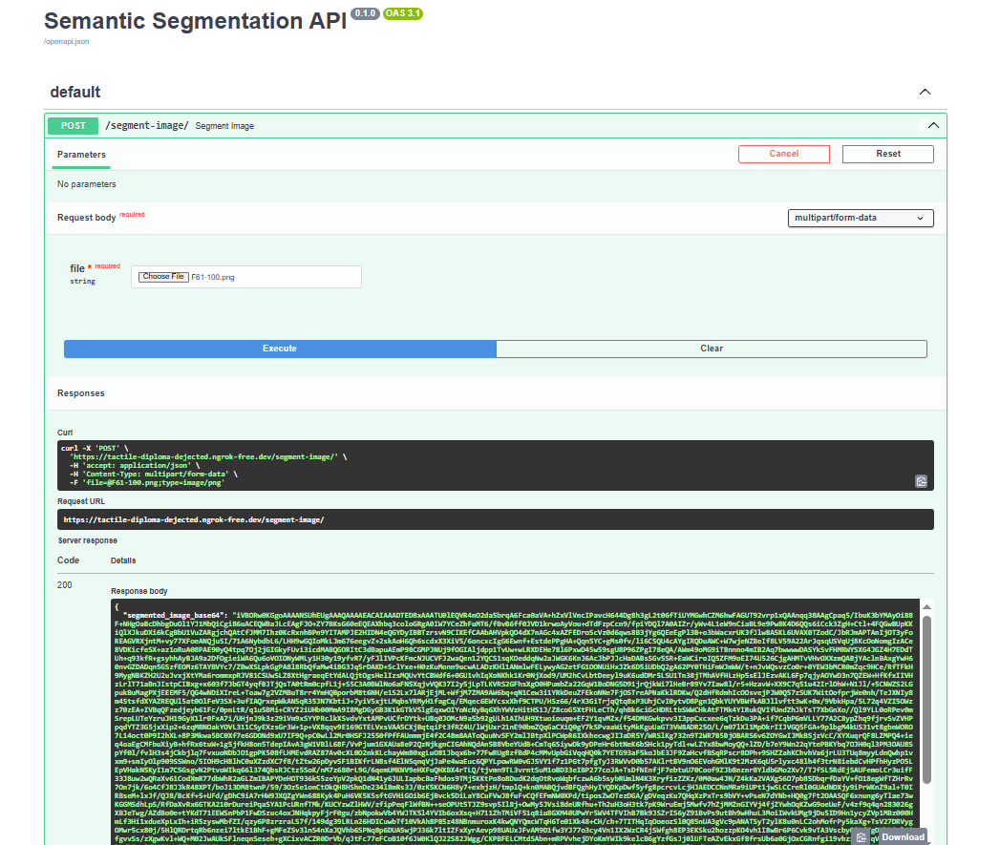

# Semantic Segmentation dengan U-Net

Segmentasi semantik tingkat piksel untuk adegan jalan raya, menggunakan U-Net yang dibangun dari nol dengan PyTorch dan disajikan lewat endpoint FastAPI.

[English](README.md)

## Ringkasan

- **Tugas:** segmentasi semantik 13 kelas (jalan, kendaraan, pohon, langit/unlabeled, dan lainnya) pada gambar RGB 256×256 hasil capture simulator CARLA.
- **Arsitektur:** U-Net (encoder-decoder dengan skip connection), dibangun dari nol di PyTorch — tanpa pretrained backbone.
- **Loss:** Multiclass Dice Loss (`segmentation-models-pytorch`).
- **Metrik:** Dice Score (`torchmetrics.segmentation.DiceScore`, input format index, micro-averaged).

## Hasil

| | |
|---|---|
| Ukuran dataset | 1.000 gambar, 13 kelas |
| Split train / test | 800 / 200 (80/20) |
| Jumlah epoch | 200 |
| Checkpoint terbaik | epoch ke-196 |
| Eval loss (terbaik) | 0.1068 |
| Dice Score (terbaik) | 0.9756 |

Angka di atas berasal dari training 200 epoch yang selesai penuh di Google Colab (GPU); checkpoint dengan eval loss terendah yang disimpan sebagai `best.pt`.





## Demo API

Notebook serving menampilkan halaman interaktif `/docs` (Swagger UI) lewat tunnel FastAPI + ngrok. Screenshot di bawah menunjukkan request `POST /segment-image/` yang berhasil, mengembalikan `200 OK` dengan mask dalam format base64.



## Struktur proyek

```
semantic-segmentation-unet/
├── notebooks/
│   ├── semantic-segmentation-unet-training.ipynb
│   └── semantic-segmentation-unet-serving.ipynb
├── assets/
│   ├── training-curve.png
│   ├── sample-segmentation-result.png
│   └── api-demo.png
├── README.md
├── README.id.md
├── LICENSE
└── .gitignore
```

## Cara menjalankan

1. **Training** — buka `notebooks/semantic-segmentation-unet-training.ipynb` di Google Colab (disarankan runtime GPU), jalankan semua cell. Notebook ini otomatis mengunduh dataset CARLA, melatih U-Net selama 200 epoch, dan menyimpan checkpoint terbaik (`best.pt`) ke Google Drive.
2. **Serving** — buka `notebooks/semantic-segmentation-unet-serving.ipynb`, mount Google Drive yang sama, jalankan semua cell. Notebook ini menjalankan server FastAPI yang di-expose lewat ngrok, dengan endpoint `/segment-image/` yang menerima upload gambar dan mengembalikan mask segmentasi dalam format base64.

## Catatan implementasi

- Postprocessing awalnya memetakan output model ke mask memakai threshold probabilitas tetap, dan ternyata menghasilkan mask kosong (semua background) walau model-nya sendiri sudah dapat Dice Score bagus saat training. Diganti ke `argmax` per piksel, yang memberi prediksi satu kelas yang deterministik per piksel dan sejalan dengan asumsi metrik evaluasi yang dipakai.
- File weight (`best.pt`) tidak disertakan di repo ini — jalankan notebook training untuk menghasilkan sendiri, atau pakai checkpoint milikmu sendiri.
- Notebook serving membutuhkan token auth ngrok yang disimpan sebagai Colab secret (`NGROK_AUTH_TOKEN`), bukan ditulis langsung di notebook.

## Dataset

[CARLA capture dataset](https://github.com/ongchinkiat/LyftPerceptionChallenge) (`carla-capture-20180513A.zip`), pasangan gambar RGB dan label segmentasi hasil simulator CARLA.

## Tech stack

PyTorch, segmentation-models-pytorch, torchmetrics, albumentations, FastAPI, pyngrok, Google Colab.

## Lisensi

MIT — lihat [LICENSE](LICENSE).
